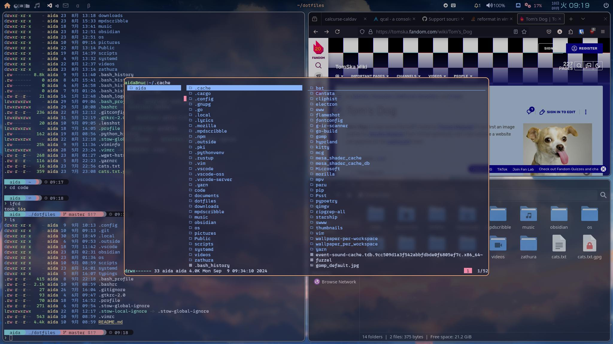
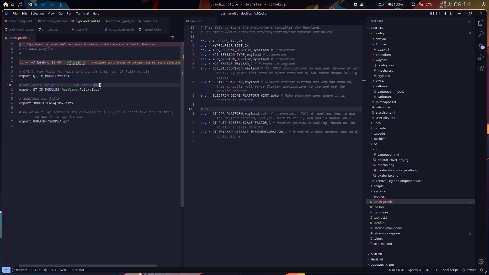
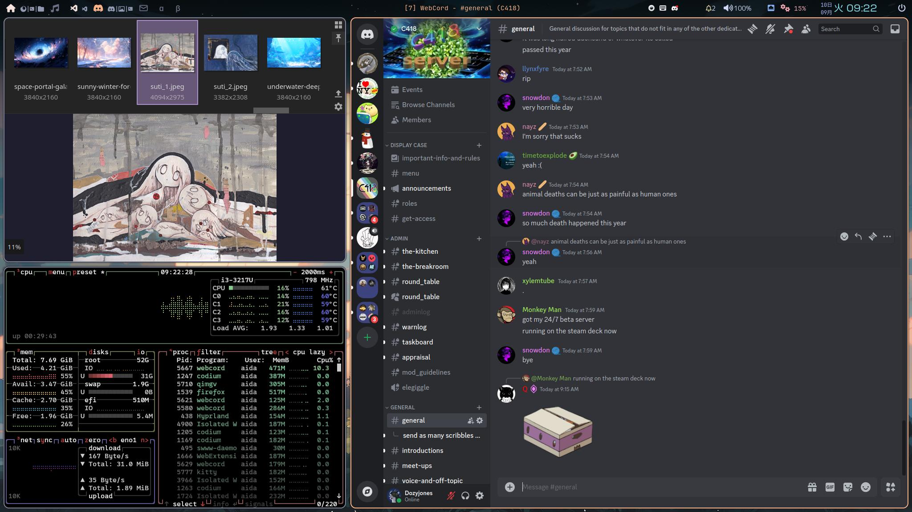
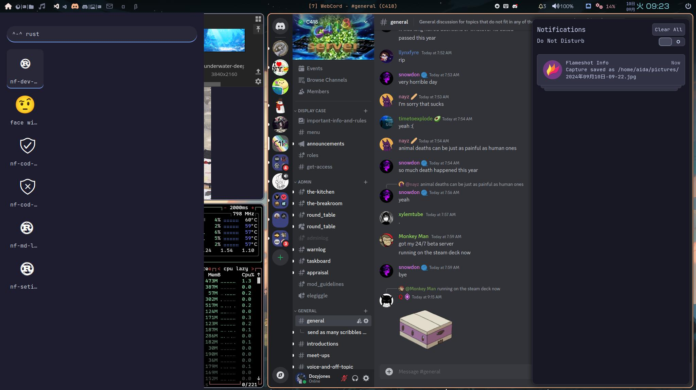
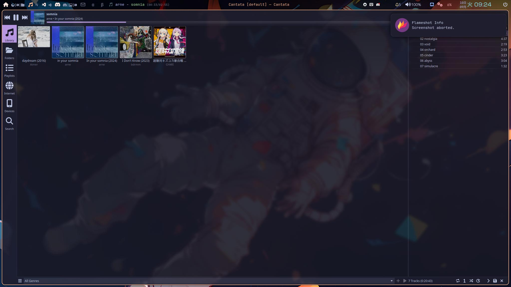
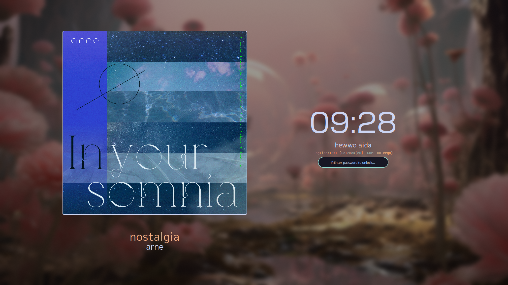

# dotfiles

Dotfiles managed using `stow`.

# Packages
Divided up into (modular) packages. Most packages only have one program, some are a collection (e.g. the arch one).
These packages have minimal dependency on eachother, so can be used in isolation as much as possible.
Each package has a:
- `<package/dependencies.txt` if they need another package to be installed. You're going to have to do this manually, pardner!
- `<package>/pkglist.txt` contains the packages you need to install. Assumed you use pacman/paru. The AUR packages are displayed together, last. You can install all of the required programs for a package using `pacman -S --needed - < pkglist.txt`
- `<package>/README.md` if they require more information.
- `<package>/install_required_programs.sh` if something requires more steps to install. 

# Fonts
Trying to keep a nice unified style! Sticking with the same fonts.
- monospace: Iosevka (and where required, Iosevka Nerd font for extra glyphs)
- Sans: Avenir Next

# Installation
Load dotfiles for a specific package simply by `cd`ing to this git dir, and running `stow <package>`
If it tries to overwrite files that exist, you can either ignore them, or use `stow --adopt <package>` to write the existing file back into this repo.

# Programs that delete don't play nice with symlinks
Some files are too happy to overwrite dotfiles. For example, JOSM thinks its easier to delete the file at `~/.config/JOSM/preferences.xml` every time, and writing a fully new one. This breaks the symlink.
There is however a solution: Have stow replace the files in the repository with the ones that are on the machine. This is done by using `stow --adopt <package>`.  
This is the recommended way to deal with programs that peskily overwrite files :), see [this stackexchange](https://unix.stackexchange.com/questions/324040/dotfiles-can-should-gnu-stow-make-hard-links-so-i-can-still-use-xfce-settin)

This command can also be used to 'discard' all the newly changed files, and replace them with what is in the git dir. Make sure your dir is up-to-date, then run  `stop --adopt` followed by `git reset --hard`.

# Manual steps required


# Other programs
Useful list for future me if i (re-)install, but if you are not me then maybe you can find some cool new packages here that I can highly recommend!

```bash
pacman -S
btop  # is a resource manager/task manager like `top` but with much more info and pretty colours
p7zip  # command line 7zip
stow  # For managing dotfiles. Duh!
github-cli  # To authorise git with github
shotcut # Video editor
util-linux  # Various utilities: SSD trim
deluge  # torrent client
gimp  # image editor
audacity  # Audio editor
digikam  # picture management software
restic  # Backup tool
syncthing  # Peer-to-peer syncing of files
signal-desktop  # messenger
yt-dlp  # Command line youtube downloader
python-build  # Enables building python projects from pyproject.toml etc. using python -m build

# And a couple from the AUR
paru -S
cantata-qt6  # graphical client for MPD
python-ics  # used in 'today-calendar' widget
freetube  # YouTube client
aylurs-gtk-shell  # Widget engine that is better than EWW. Not used yet.
nordvpn-bin  # vpn
```

# Screenshots







